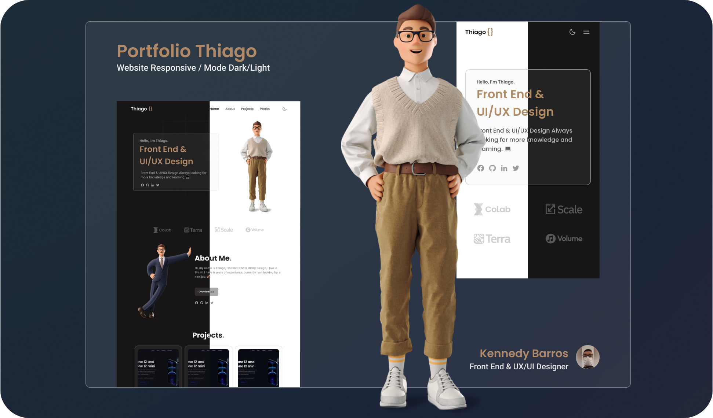

<h1 align="center">
    
</h1>

<h1 align="center">
    
</h1>

<h3 align="center">You can access the project <a href="https://reponsive-portfolio-website-thiago.netlify.app/" target="_blank">Clicking here</a></h3>

---

</br>

# Technologies

- [HTML](https://www.w3schools.com/html/)
- [CSS](https://www.w3schools.com/css/)
- [JavaScript](https://developer.mozilla.org/en-US/docs/Web/JavaScript)
- [ScrollReveal](https://scrollrevealjs.org/)
- [Swiper](https://swiperjs.com/)

---

<br/>

## How to download the project:

```bash
# Clone the repository
$ git clone https://github.com/kennedybarros/reponsive-portfolio-website-thiago

# Enter directory
$ cd responsive-portfolio-website-thiago
```

---

<p align="center"> Developed by <a href="https://www.linkedin.com/in/kennedybarros/">Kennedy Barros</a> ✌🏼</p>
